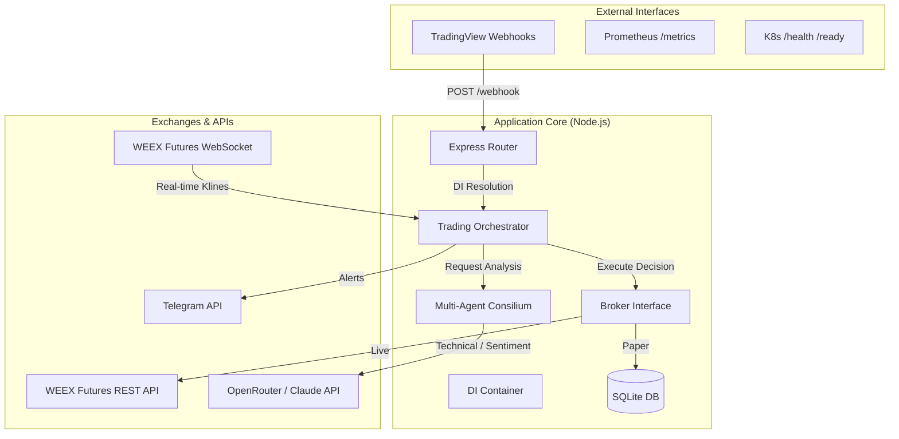
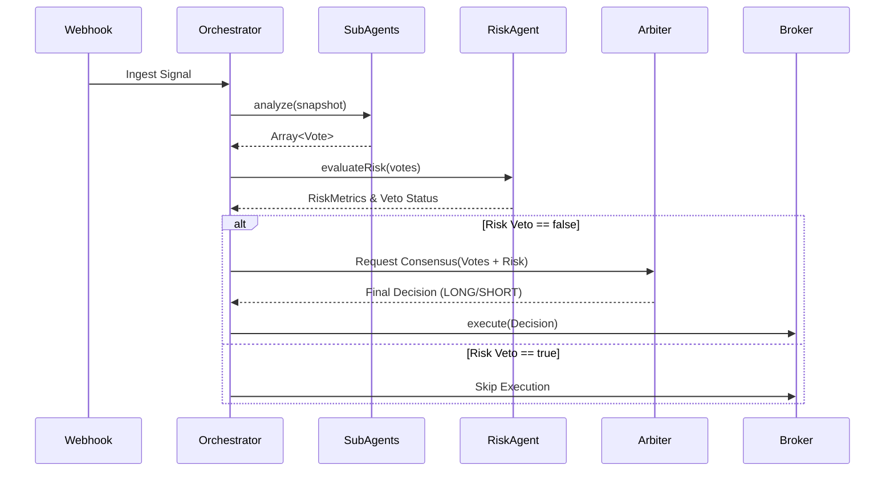

# AlgoTrade Pro: Enterprise Architecture

This document outlines the architectural design of the AlgoTrade Pro system, built for high-reliability algorithmic futures trading on the WEEX exchange.

## 1. System Overview

AlgoTrade Pro is a Node.js-based distributed algorithmic trading system. It utilizes a **Multi-Agent Consensus (Consilium)** architecture, where multiple independent sub-agents analyze market conditions and a central LLM Arbiter (powered by Claude via OpenRouter) makes the final trading decision.

The system is designed with **Enterprise-grade patterns**:
- **Dependency Injection (DI)** for decoupled, testable components.
- **Circuit Breakers** for external API resilience.
- **Pure Functions** for deterministic indicator calculations.
- **Event-Driven WebSockets** for real-time market data.

## 2. High-Level Architecture

## 3. Core Components

### 3.1. Dependency Injection Container (`src/container.js`)
A lightweight, bespoke IoC container manages the lifecycle of all services. It supports Singletons, Transients, and Value registrations. This pattern ensures that database connections, WebSocket clients, and API clients are initialized once and injected wherever needed, drastically simplifying unit testing via mock injection.

### 3.2. Trading Orchestrator (`src/services/tradingOrchestrator.js`)
The central nervous system. It receives formatted signals from the Webhook router, fetches the latest market snapshot, delegates analysis to the Agent Consilium, and finally routes the decision to the execution Broker.

### 3.3. AI Consilium (`src/agents/`)
A distributed decision-making layer consisting of specialized agents:
- **TechnicalAgent**: Evaluates pure price action (EMA, RSI, MACD).
- **BlackMirrorAgent**: Executes a proprietary trend-following algorithm (Black Mirror Ultra).
- **ChandelierAgent**: Manages dynamic trailing stop-loss logic based on ATR volatility.
- **SentimentAgent**: (Future) Ingests external news/sentiment data.
- **RiskAgent**: The absolute authority on capital preservation. Computes dynamic position sizing using ATR and enforces max drawdown rules. Can `VETO` any trade.
- **Arbiter**: An LLM (Claude) that receives JSON payloads from all sub-agents and provides the final `LONG`, `SHORT`, or `NEUTRAL` verdict.

### 3.4. Broker Layer (`src/execution/`)
Abstracts execution logic, allowing seamless switching between Paper Trading and Live Trading.
- **LiveBroker**: Interacts with the `WeexFuturesClient` to place real market/limit orders, adhering to exchange precision rules.
- **PaperBroker**: Simulates order execution against the local SQLite database for forward-testing and strategy validation.

### 3.5. WEEX Infrastructure (`src/api/weex/`)
- **WeexFuturesClient**: A robust REST client with HMAC-SHA256 signing, built-in retry mechanisms, and `opossum` Circuit Breakers to prevent cascading failures during exchange outages.
- **WeexWebSocket**: An auto-reconnecting WebSocket client managing real-time subscriptions to kline channels.

## 4. Data Storage

Uses a local `sql.js` SQLite database synced to disk (`data/trades.db`).
Key tables:
- `positions`: Tracks open, partial, and closed positions, realized PnL, entry prices, and dynamic stop-losses.
- `decisions`: Audit log of every trade decision, including LLM reasoning and agent confidence metrics.
- `market_snapshots`: Historical state of indicators at the exact moment a decision was made.

## 5. Observability & Telemetry

To ensure enterprise reliability, the system features:
- **Request Tracing**: `UUIDv4` injected via Express middleware propagates through the `winston` logger, linking all logs of a single webhook invocation.
- **Prometheus Metrics**: `src/routes/metrics.js` exports `/metrics` natively, exposing custom gauges (`algotrade_realised_pnl_usdt`), counters, and latency histograms for LLM and Webhook processing times.
- **Liveness Probes**: K8s-compliant `/health` and `/ready` endpoints.
